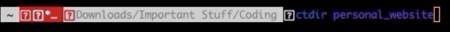

# *ctdir new_directory*, A command which simplifies the new programming directory process.


[](https://youtu.be/4-oUipozodc "Preview of the Command")


This Command does the following:
* Creates and Moves into a directory
* Creates a README.md and a .gitignore
* Creates and adds files to the master branch
* Creates and adds files to the .gitignore
* First commit is done
* Creates and pushes changes to a private remote repository
* Opens VSCode 


## Installation

* After you have installed the file, first make the file an executable.
```bash
chmod +x ctdir
```

* Second, you have to add your file to PATH. The process depends based on your operating system but the resource below will help you add the file to PATH
https://gist.github.com/nex3/c395b2f8fd4b02068be37c961301caa7

* Then, on line 52 you need to add your github username to the USERNAME variable
```bash
USERNAME="YourGithubUsername"
```

* Finally, you need to add a personal access token. To do this you need to go to developer settings in the Github settings page. Then go to personal access tokens section and create a new token. You need to click the first box "repo", the box below that called "write:packages", the the box called "read:packages" and click create. Add your token to the TOKEN variable on line 52.
```bash
curl -H 'Authorization: token AddYourTokenHere' https://api.github.com/user/repos -d "$NEWVAR"
```
## Usage
```bash
ctdir new_directory
```
Type the command ctdir and the directory name
```bash
app.py index.html main.css
```
To add new files type them in and add a space. This same format is used for the .gitignore file insertion and the master branch file insertion

Finally, you will be prompted to type in the title of your remote repository. After this you will need to enter in your ssh password to finish the process.

## Contributing
Pull requests are welcome. If you have a idea on how to create a directories with files within them during the file insertion process, please create a pull request.

